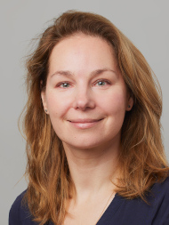
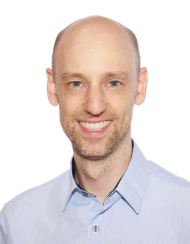
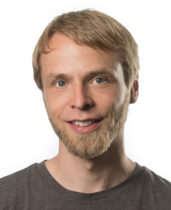

          <h3>Keynote speakers</h3>

	  <!-- To be announced. -->
	  
          <table width="100%" border="1">
            <tbody>
              <tr>
                <td> 
                </td>
                <td><a href="https://boevalab.inf.ethz.ch/index.html"> Valentina Boeva</a> 
                  Assistant Professor 
                  ETH Zurich, Switzerland</td>
              </tr>
              <tr>
                <td> 
                </td>
                <td><a href="https://jglab.org/"> Jonathan Göke</a> 
                  Group Leader 
                  Genome Institute of Singapore</td>
              </tr>
              <tr>
                <td> 
                </td>
                <td><a href="https://marschall-lab.github.io/"> Tobias Marschall</a> 
                  Professor 
                  Heinrich Heine University Düsseldorf, Germany</td>
              </tr>
            </tbody>
          </table>
          
 
          

	  

<h3>Wednesday July 23, 2025</h3>

All times listed are in BST, Room: 01A

<table style="width: 100%;" border="0">
<tbody>
<tr>
 <td style="vertical-align: top;"><strong>11:20-12:20</strong></td>
 <td style="vertical-align: top;">
<strong>Invited Presentation:</strong> Learning variant effects on chromatin accessibility and 3D structure without matched Hi-C data Presenter Valentina Boeva, ETH Zurich, Switzerland (in person)</td>
</tr>
<tr>
 <td style="vertical-align: top;"><strong>12:20-12:40</strong></td>
 <td style="vertical-align: top;">Proceedings Presentation: Spatial transcriptomics deconvolution methods generalize well to spatial chromatin accessibility data Sarah Ouologuem, Laura D. Martens, Anna C. Schaar, Maiia Shulman, Julien Gagneur, Fabian J. Theis Presenter Laura D. Martens, Technical University Munich, Germany (in person)</td>
</tr>
<tr>
 <td style="vertical-align: top;"><strong>12:40-13:00</strong></td>
 <td style="vertical-align: top;">Towards Personalized Epigenomics: Learning Shared Chromatin Landscapes and Joint De-Noising of Histone Modification Assays Tanmayee Narendra, Giovanni Visonà, Crhistian de Jesus Cardona, James Abbott, Gabriele Schweikert Presenter Tanmayee Narendra, University of Dundee, United Kingdom (in person)</td>
</tr>
<tr>
 <td style="vertical-align: top;"><strong>14:00-14:20</strong></td>
 <td style="vertical-align: top;">Proceedings Presentation: Alevin-fry-atac enables rapid and memory frugal mapping of single-cell ATAC-Seq data using virtual colors for accurate genomic pseudoalignment Noor Pratap Singh, Jamshed Khan, Rob Patro Presenter Noor Pratap Singh, University of Maryland - College Park, United States (in person)</td>
</tr>
<tr>
 <td style="vertical-align: top;"><strong>14:20-14:40</strong></td>
 <td style="vertical-align: top;">Proceedings Presentation: Oarfish: Enhanced probabilistic modeling leads to improved accuracy in long read transcriptome quantification Zahra Zare Jousheghani, Noor Pratap Singh, Rob Patro Presenter Zahra Zare Jousheghani, University of Maryland, College Park, United States (in person)</td>
</tr>
<tr>
 <td style="vertical-align: top;"><strong>14:40-15:00</strong></td>
 <td style="vertical-align: top;">Identification of interactions defining 3D chromatin folding from micro to meso-scale Leonardo Morelli, Stefano Cretti, Davide Cittaro, Tiago P. Peixoto, Alessio Zippo Presenter Leonardo Morelli, University of Trento, Italy (in person)</td>
</tr>
<tr>
 <td style="vertical-align: top;"><strong>15:00-15:20</strong></td>
 <td style="vertical-align: top;">SpliSync: Genomic language model-driven splice site correction of long RNA reads Wui Wang Lui, Liliana Florea Presenter Liliana Florea, Johns Hopkins University, United States (in person)</td>
</tr>
<tr>
 <td style="vertical-align: top;"><strong>15:20-15:30</strong></td>
 <td style="vertical-align: top;">adverSCarial: a toolkit for exposing classifier vulnerabilities in single-cell transcriptomics Ghislain Fievet, Julien Broséus, David Meyre, Sébastien Hergalant Presenter Ghislain Fievet, Université de Lorraine, France (in person)</td>
</tr>
<tr>
 <td style="vertical-align: top;"><strong>15:30-15:40</strong></td>
 <td style="vertical-align: top;">Quality assessment of long read data in multisample lrRNA-seq experiments using SQANTI-reads Netanya Keil, Carolina Monzó, Lauren McIntyre, Ana Conesa Presenter Netanya Keil, University of Florida, United States (in person)</td>
</tr>
<tr>
 <td style="vertical-align: top;"><strong>15:40-16:00</strong></td>
 <td style="vertical-align: top;">Proceedings Presentation: Transcriptome Assembly at Single-Cell Resolution with Beaver Qian Shi, Qimin Zhang, Mingfu Shao Presenter Qian Shi, The Pennsylvania State University, United States (live stream)</td>
</tr>
<tr>
 <td style="vertical-align: top;"><strong>16:40-17:00</strong></td>
 <td style="vertical-align: top;"><strong>Invited Presentation:</strong> Bioinformatics analysis for long-read RNA sequencing: challenges and promises Presenter Elizabeth Tseng, Pacific Biosciences, United States (in person)</td>
</tr>
<tr>
 <td style="vertical-align: top;"><strong>17:00-18:00</strong></td>
 <td style="vertical-align: top;"><strong>Invited Presentation:</strong> Quantifying RNA Expression and Modifications using Long Read RNA-Seq Presenter Jonathan Göke, Genome Institute of Singapore (in person)</td>
</tr>
</tbody>
</table>

<h3>Thursday, July 24, 2025</h3>

All times listed are in BST, Room: 01A

            
<table style="width: 100%;" border="0">
<tbody>

<tr>
 <td style="vertical-align: top;"><strong>08:40-09:40</strong></td>
 <td style="vertical-align: top;"><strong>Invited Presentation:</strong> Pangenome based analysis of structural variation Presenter Tobias Marschall, Heinrich Heine University Düsseldorf, Germany (in person)</td>
</tr>
<tr>
 <td style="vertical-align: top;"><strong>09:40-10:00</strong></td>
 <td style="vertical-align: top;"><strong>Invited Presentation:</strong> Resolving Paralogues and Multi-Copy Genes with Nanopore Long-Read Sequencing Presenter Sergey Nurk, Oxford Nanopore Technologies (in person)</td>
</tr>
<tr>
 <td style="vertical-align: top;"><strong>11:20-11:40</strong></td>
  <td style="vertical-align: top;">Proceedings Presentation: CREMSA: Compressed Indexing of (Ultra) Large Multiple Sequence Alignments Mikaël Salson, Arthur Boddaert, Awa Bousso Gueye, Laurent Bulteau, Yohan Hernandez-Courbevoie, Camille Marchet, Nan Pan, Sebastian Will, Yann Ponty Presenter Mikaël Salson, CNRS, France (in person)</td>
</tr>
<tr>
 <td style="vertical-align: top;"><strong>11:40-12:00</strong></td>
 <td style="vertical-align: top;">Proceedings Presentation: Exploiting uniqueness: seed-chain-extend alignment on elastic founder graphs Nicola Rizzo, Manuel Cáceres, Veli Mäkinen Presenter Nicola Rizzo, University of Helsinki, Finland (in person)</td>
</tr>
<tr>
 <td style="vertical-align: top;"><strong>12:00-12:20</strong></td>
 <td style="vertical-align: top;">FroM Superstring to Indexing: a space-efficient index for unconstrained k-mer sets using the Masked Burrows-Wheeler Transform (MBWT) Ondřej Sladký, Pavel Veselý, Karel Brinda Presenter Ondřej Sladký, Charles University, Czechia (in person)</td>
</tr>
<tr>
 <td style="vertical-align: top;"><strong>12:20-12:40</strong></td>
 <td style="vertical-align: top;">The Alice assembler: dramatically accelerating genome assembly with MSR sketching Roland Faure, Jean-François Flot, Dominique Lavenier Presenter Roland Faure, Institut Pasteur, Paris, France (in person)</td>
</tr>
<tr>
 <td style="vertical-align: top;"><strong>12:40-13:00</strong></td>
 <td style="vertical-align: top;">BINSEQ: A Family of High-Performance Binary Formats for Nucleotide Sequences Noam Teyssier, Alexander Dobin Presenter Noam Teyssier, Arc Institute, United States (in person)</td>
</tr>
<tr>
 <td style="vertical-align: top;"><strong>14:00-14:20</strong></td>
 <td style="vertical-align: top;">Proceedings Presentation: Ultrafast and Ultralarge Multiple Sequence Alignments using TWILIGHT Yu-Hsiang Tseng, Sumit Walia, Yatish Turakhia Presenter Yu-Hsiang Tseng, University of California San Diego, United States (in person)</td>
</tr>
<tr>
 <td style="vertical-align: top;"><strong>14:20-14:40</strong></td>
  <td style="vertical-align: top;">Proceedings Presentation: GreedyMini: Generating low-density DNA minimizers Shay Golan, Ido Tziony, Matan Kraus, Yaron Orenstein, Arseny Shur Presenter Arseny Shur Bar Ilan University, Israel (in person)</td>
</tr>
<tr>
 <td style="vertical-align: top;"><strong>14:40-15:00</strong></td>
 <td style="vertical-align: top;">Proceedings Presentation: LYCEUM: Learning to call copy number variants on low coverage ancient genomes Mehmet Alper Yilmaz, Ahmet Arda Ceylan, Gun Kaynar, A. Ercument Cicek Presenter Mehmet Alper Yilmaz, Bilkent University, Turkey (in person)</td>
</tr>
<tr>
 <td style="vertical-align: top;"><strong>15:00-15:20</strong></td>
 <td style="vertical-align: top;">POPSICLE: a probabilistic method to capture uncertainty in single-cell copy-number calling Lucrezia Patruno, Sophia Chirrane, Simone Zaccaria Presenter Lucrezia Patruno, University College London Cancer Institute, Cancer Research UK Lung Cancer Centre of Excellence, United Kingdom (in person)</td>
</tr>
<tr>
 <td style="vertical-align: top;"><strong>15:20-15:40</strong></td>
 <td style="vertical-align: top;">MutSuite: A Toolkit for Simulating and Evaluating Mutations in Aligned Sequencing Reads Kendell Clement Presenter Kendell Clement, University of Utah, United States (in person)</td>
</tr>
<tr>
 <td style="vertical-align: top;"><strong>15:40-16:00</strong></td>
 <td style="vertical-align: top;">Landscape of The Dark Genome’s variants and their influence on cancer Joao P. C. R. Mendonca, Kristoffer Staal Rohrberg, Peter Holst, Frederik Otzen Bagger Presenter Joao P. C. R. Mendonca, Rigshospitalet, Denmark (in person)</td>
</tr>
