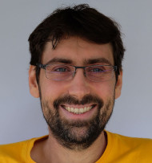
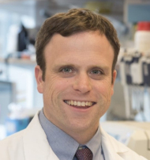
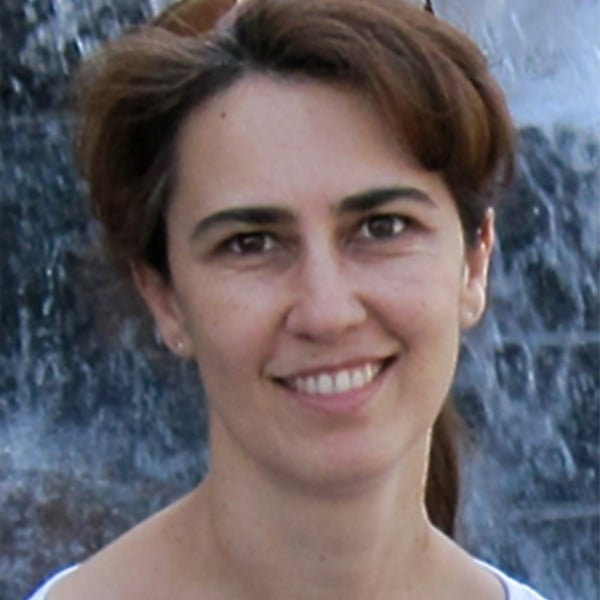

          <h3>Keynote speakers</h3>

          <table width="100%" border="1">
            <tbody>
              <tr>
                <td> 
                </td>
                <td><a href="https://bmi.inf.ethz.ch/people/person/andre-kahles">Andre Kahles</a> 
                  Senior Scientist 
                  ETH Zürich, Switzerland</td>
              </tr>
              <tr>
                <td> 
                </td>
                <td><a href="https://www.masonlab.net/">Christopher E. Mason</a> 
                  Professor 
                  Weill Cornell Medicine, USA</td>
              </tr>
              <tr>
                <td> 
                </td>
                <td><a href="https://pertealab.org/">Mihaela Pertea</a> 
                  Associate Professor 
                  Johns Hopkins University, USA</td>
              </tr>
            </tbody>
          </table>	
          
 
          

	  

<!--
<h3>Monday July 13, 2026</h3>

All times listed are in EST, Room: International Ballroom Center

...
-->

<h3>Monday, July 13, 2026</h3>

All times listed are in EST, Room: International Ballroom Center

<table style="width: 100%;" border="0">
<tbody>
<tr>
 <td style="vertical-align: top;"><strong>11:00-11:05</strong></td>
 <td style="vertical-align: top;"><strong>Welcome</strong></td>
</tr>
<tr>
 <td style="vertical-align: top;"><strong>11:05-12:00</strong></td>
 <td style="vertical-align: top;">Keynote:  From Reads to Retrieval: Petabase-Scale Sequence Search with MetaGraph Andre Kahles Presenter Andre Kahles (in person)</td>
</tr>
<tr>
 <td style="vertical-align: top;"><strong>12:00-12:20</strong></td>
 <td style="vertical-align: top;">Proceedings Presentation: Scalable computation of ultrabubbles in pangenomes by orienting bidirected graphs Juha Harviainen, Francisco Sena, Corentin Moumard, Aleksandr Politov, Sebastian Schmidt, Alexandru I. Tomescu Presenter Corentin Moumard (in person)</td>
</tr>
<tr>
 <td style="vertical-align: top;"><strong>12:20-12:40</strong></td>
 <td style="vertical-align: top;">Proceedings Presentation: RLBWT-Based LCP Computation in Compressed Space for Terabase-Scale Pangenome Analysis Ahsan Sanaullah, Nathaniel Brown, Pramesh Shakya, Arun Deegutla, Ardalan Naseri, Benjamin Langmead, Degui Zhi, Shaojie Zhang Presenter Ahsan Sanaullah (in person)</td>
</tr>
<tr>
 <td style="vertical-align: top;"><strong>12:40-13:00</strong></td>
 <td style="vertical-align: top;">ImpuT2T: Pangenome-Based Patching for Human Genome Assemblies Mao-Jan Lin, Vikram Shivakumar, Ben Langmead Presenter Mao-Jan Lin (in person)</td>
</tr>
<tr>
 <td style="vertical-align: top;"><strong>14:20-14:40</strong></td>
 <td style="vertical-align: top;">Proceedings Presentation: Optimizing sparse and skew hashing: faster k-mer dictionaries Giulio Ermanno Pibiri, Rob Patro Presenter Rob Patro (in person)</td>
</tr>
<tr>
 <td style="vertical-align: top;"><strong>14:40-15:00</strong></td>
 <td style="vertical-align: top;">10-minimizers: a promising class of constant-space minimizers Arseny Shur, Ido Tziony, Yaron Orenstein Presenter Yaron Orenstein (in person)</td>
</tr>
<tr>
 <td style="vertical-align: top;"><strong>15:00-15:20</strong></td>
 <td style="vertical-align: top;">The gift of novelty: repeat-robust k-mer-based estimators of mutation rates Haonan Wu, Paul Medvedev Presenter Haonan Wu (in person)</td>
</tr>
<tr>
 <td style="vertical-align: top;"><strong>15:20-15:40</strong></td>
 <td style="vertical-align: top;">Proceedings Presentation: Incorporating indel channels into average-case analysis of seed-chain-extend Spencer Gibson, Yun William Yu Presenter Spencer Gibson (in person)</td>
</tr>
<tr>
 <td style="vertical-align: top;"><strong>15:40-16:00</strong></td>
 <td style="vertical-align: top;">ORION: A High-Performance Barcode and UMI Correction Tool for Oxford Nanopore Single-Cell Sequencing Dohun Yi, Jin-Wu Nam Presenter Dohun Yi (in person)</td>
</tr>
<tr>
 <td style="vertical-align: top;"><strong>16:20-16:40</strong></td>
 <td style="vertical-align: top;">SpatiaXen: An Open-Source Interactive Platform for Cell-Type-Resolved Spatial Transcriptomics Analysis Anirban Chakraborty, Cort Thompson, Lauren Wade-Kleyn, Mark Reimers, Erin Purcell Presenter Anirban Chakraborty (in person)</td>
</tr>
<tr>
 <td style="vertical-align: top;"><strong>16:40-17:00</strong></td>
 <td style="vertical-align: top;">Proceedings Presentation: Detecting and reconstructing breakage-fusion-bridge cycles from long-read sequencing using BFBArchitect Chaohui Li, Siavash Raeisi Dehkordi, Daniel Muliaditan, Ramanuj Dasgupta, Jens Luebeck, Kaiyuan Zhu, Vineet Bafna Presenter Chaohui Li (in person)</td>
</tr>
<tr>
 <td style="vertical-align: top;"><strong>17:00-18:00</strong></td>
 <td style="vertical-align: top;">Keynote: Genetic and epigenetic engineering and technologies to prepare for deep space Christopher Mason Presenter Christopher Mason (in person)</td>
</tr>
</tbody>
</table>

<h3>Tuesday, July 14, 2026</h3>

All times listed are in EST, Room: International Ballroom Center

<table style="width: 100%;" border="0">
<tbody>
<tr>
 <td style="vertical-align: top;"><strong>11:00-12:00</strong></td>
 <td style="vertical-align: top;">Keynote: From Reads to Transcripts to Biological Insight Mihaela Pertea Presenter Mihaela Partea (in person)</td>
</tr>
<tr>
 <td style="vertical-align: top;"><strong>12:00-12:20</strong></td>
 <td style="vertical-align: top;">scVarSim: A Unified Simulator for Benchmarking Genetic Variant Calling and RNA Editing Detection in Single-Cell RNA-seq Data Weijian Wang, Jingyi Jessica Li Presenter Weijian Wang (in person)</td>
</tr>
<tr>
 <td style="vertical-align: top;"><strong>12:20-12:40</strong></td>
 <td style="vertical-align: top;">Spatiotemporal cell type deconvolution leveraging tissue structure Macrina Lobo, Ziqi Zhang, Xiuwei Zhang Presenter Xiuwei Zhang (in person)</td>
</tr>
<tr>
 <td style="vertical-align: top;"><strong>12:40-13:00</strong></td>
 <td style="vertical-align: top;">MethylSeg: Context-Aware Methylome Segmentation Enables Robust PMD Detection in Array and WGBS Data Jacob Tye, Kendell Clement Presenter Jacob Tye (in person)</td>
</tr>
<tr>
 <td style="vertical-align: top;"><strong>14:20-14:40</strong></td>
 <td style="vertical-align: top;">Amaranth: Enhanced Single-Cell Transcript Assembly via Discriminative Modeling of UMI Reads and Internal Reads Xiaofei Carl Zang, Tasfia Zahin, Irtesam Mahmud Khan, Qian Shi, Yi Xing, Mingfu Shao Presenter Xiaofei Carl Zang (in person)</td>
</tr>
<tr>
 <td style="vertical-align: top;"><strong>14:40-15:00</strong></td>
 <td style="vertical-align: top;">Minerva: Breakpoint-Guided Allele-Specific Copy Number Inference in Long-Read Cancer Genomes Ayse Keskus, Tanveer Ahmad, Isabel Rodriguez, Anton Goretsky, Ataberk Donmez, Sonam Tulsyan, Nicholas Syracuse, Michael Dean, Mikhail Kolmogorov Presenter Ayse Keskus (in person)</td>
</tr>
<tr>
 <td style="vertical-align: top;"><strong>15:00-15:20</strong></td>
 <td style="vertical-align: top;">Unravelling genome-wide mosaic microsatellite mutations at single-cell resolution Yanmei Dou Presenter Yanmei Dou (in person)</td>
</tr>
<tr>
 <td style="vertical-align: top;"><strong>15:20-15:40</strong></td>
 <td style="vertical-align: top;">SQANTI-epi: Functional and Quality Annotation of Single-Molecule Epigenomic Data Tianyuan Liu, Ana Conesa Presenter Tianyuan Liu (virtual)</td>
</tr>
<tr>
 <td style="vertical-align: top;"><strong>15:40-16:00</strong></td>
 <td style="vertical-align: top;">Proceedings Presentation: Likelihood-based optimization enables accurate copy number estimation for paralogous genes using exome data Sang Yoon Byun, Vikas Bansal Presenter Sang Yoon Byun (in person)</td>
</tr>
<tr>
 <td style="vertical-align: top;"><strong>16:40-17:00</strong></td>
 <td style="vertical-align: top;">Proceedings Presentation: Seqwin: Ultrafast identification of signature sequences in microbial genomes Michael X. Wang, Bryce Kille, Michael G. Nute, Siyi Zhou, Lauren B. Stadler, Todd J. Treangen Presenter Michael X. Wang (in person)</td>
</tr>
<tr>
 <td style="vertical-align: top;"><strong>17:00-17:20</strong></td>
 <td style="vertical-align: top;">Proceedings Presentation: pHapCompass: Probabilistic Assembly and Uncertainty Quantification of Polyploid Haplotype Phase Marjan Hosseini, Ella Veiner, Thomas Bergendahl, Tala Yasenpoor, Zane Smith, Margaret Staton, Derek Aguiar Presenter Marjan Hosseini (in person)</td>
</tr>
<tr>
 <td style="vertical-align: top;"><strong>17:20-17:40</strong></td>
 <td style="vertical-align: top;">Pilot discovery of allele-specific modification QTLs from long-read RNA sequencing Michael Goneos, Theodore Nelson, Christopher Mason Presenter Michael Goneos (in person)</td>
</tr>
<tr>
 <td style="vertical-align: top;"><strong>17:40-18:00</strong></td>
 <td style="vertical-align: top;">CRANE: Correcting Errors in Raw Nanopore Signals Using Hidden Markov Models Simon Ambrozak, Ulysse McConnell, Bhargav Srinivasan, Burak Ozkan, Ernest Zhang, Can Firtina Presenter Simon Ambrozak (in person)</td>
</tr>
</tbody>
</table>
